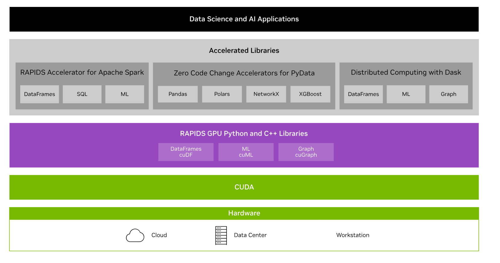

***********************************************************
What is ROCm-DS?
***********************************************************

ROCm™-DS is an open-source software platform that enables high-performance computing and machine learning applications. It features the ability to accelerate training, fine-tuning, and inference for data science models. With ROCm, you can access the full power of AMD GPUs, which can significantly improve the performance, productivity, and computation of data science models.

Overall, ROCm-DS can be used to improve the performance and efficiency of your data science models. With its training, fine-tuning, and inference support, ROCm-DS provides a complete solution for optimizing data science workflows and achieving the optimum results possible on AMD GPUs.

Specifically, ROCm-DS provides the tools for
:doc:`HIP (Heterogeneous-computing Interface for Portability) <hip:index>`,
OpenCL and OpenMP. These include compilers, libraries for high-level
functions, debuggers, profilers and runtimes.

ROCm-DS components
===============================================

ROCm-DS consists of the following components

Packages
-----------------------------------------------

.. csv-table::
  :header: "Packages", "Description"

  "hipDF", "Package to create Data frames"
  "hipGraph", "Graph inference engine that accelerates data model inference"
  "hipMM", "Package to manage models"
  "hipRAFT", "Package for RAFT"